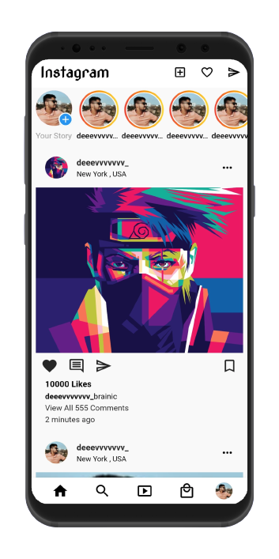
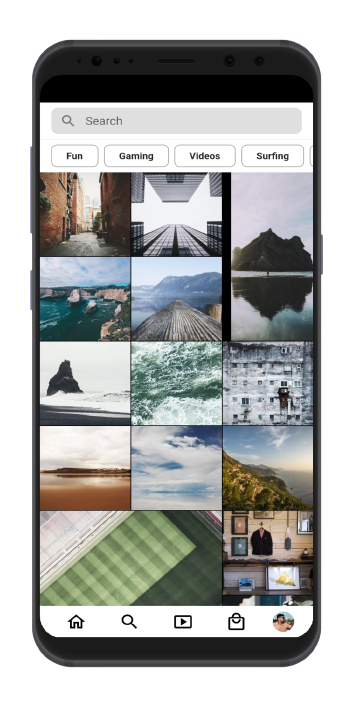
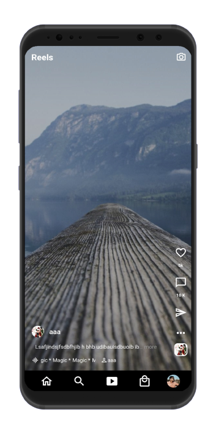
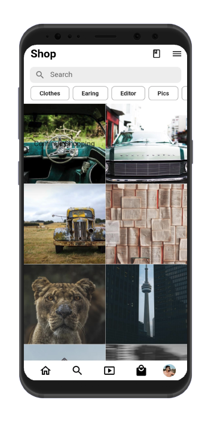
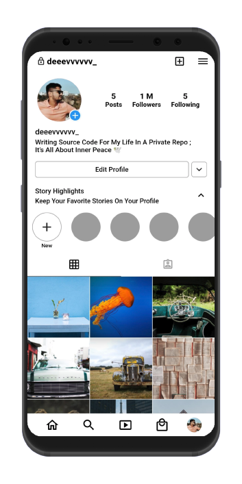

# Instagram UI

InstagramUI  App is a UI clone of a famous social media app called 
[Instagram](https://play.google.com/store/apps/details?id=com.instagram.android&hl=en_IN&gl=US)
built using Flutter. Show some ❤️ and star ⭐ the repo if you liked it, 
it makes me to share more open source flutter projects.
    
Watch Video - [Click Here](https://youtu.be/Q7fwjTItuao)  

## Screenshots

### Mobile UI

- All Screens 

Screen 1               |  Screen 2  | Screen 3                            |  Screen 4 |Screen 5 
:-------------------------:|:-------------------------:|:-------------------------:|:-------------------------:|-------------------------:
||||

  Made With Flutter 💙

